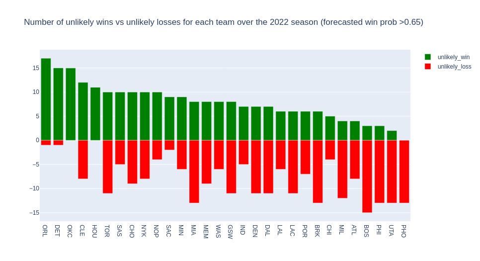

# Project of Data Visualization (COM-480)

| Student's name | SCIPER |
| -------------- | ------ |
| Son Le | 352463 |
| Amey Kulkarni | 353055 |
| Somesh Mehra | 353628 |

[Milestone 1](#milestone-1) • [Milestone 2](#milestone-2) • [Milestone 3](#milestone-3)

## Milestone 1 (7th April, 5pm)

**10% of the final grade**

This is a preliminary milestone to let you set up goals for your final project and assess the feasibility of your ideas.
Please, fill the following sections about your project.

*(max. 2000 characters per section)*

### Dataset

We will be using data primarily from 2 sources: [NBA](https://www.nba.com/) for official NBA related data/statistics, and [FiveThirtyEight](https://data.fivethirtyeight.com/) for additional advanced NBA stats.

#### _FiveThirtyEight data_

The data from FiveThirtyEight is directly downloaded from their website. In particular, we use two datasets: [nba-raptor](https://github.com/fivethirtyeight/data/tree/master/nba-raptor) containing FiveThirtyEight's RAPTOR statistics for each player (historic and current), and [nba-forecasts](https://github.com/fivethirtyeight/data/tree/master/nba-forecasts) containing game by game elo ratings and forecasts for teams since 1946. All  datasets are formatted as CSVs.

**nba-raptor**

The full calculation of the RAPTOR statistic relies on full player tracking data, which has only been captured since the 2013-14 NBA season. Despite this, the nba-raptor dataset contains historical data back until 1977, by estimating RAPTOR using the highest level of detail available in each era. For consistency, we only consider data from the 2013-14 season onward for most accurate stats. In addition, for each player, we would like to get their career history (all the teams they have played for, in chronological order), so we did some additional preprocessing to obtain the correct order of teams for each player. Details can be found in `utils.py`.

**nba-forecasts**

This dataset is quite clean already for the purposes we need. The columns we are interested in for our visualisations (team and elo related columns) do not have missing values (other than future games which we can't have those values yet, and we want to ignore anyway). The dataset does include some advanced statistics which are only available for a small subset of games, however our elo related visualisations do not require these.

#### _NBA data_

We use the Kaggle dataset [NBA Database](https://www.kaggle.com/datasets/wyattowalsh/basketball) with numerous tables to source most of our NBA data. However, some tables in this dataset, provided as is, are incomplete (such as the `common_player_info` table). Thus to fill in the gaps of this table, we scraped the missing players using the [NBA API](https://github.com/swar/nba_api) (where the Kaggle dataset is also originally sourced from).

### Problematic

The NBA community has a lot of visualisations and analyses already, however, we have identified some interesting ideas that have not yet been explored much (to our knowledge).
Our goal through this project is to be able to create some new visualisations that are informative and interesting for NBA fans.

We are exploring many different directions for our visualisation. Our main visualisation ideas are:
- visualising the path of each player to their current team
- looking at players' performance and how being traded, getting injured, and so on affects their impact
- highlighting the differences in performance between the regular season and the post-season of certain players
- using game-to-game win probabilities to historically look at the biggest upsets

### Exploratory Data Analysis

_**Please note:** we have split our EDA across 3 notebooks, one looking at each main dataset/visualisation idea._

#### Descriptive statistics of the NBA dataset

* NBA players are on average about 198cm tall and 95kg heavy

* Throughout their career, each player on average plays for 4 seasons and 2 teams. The longest career is 22 seasons long, and the shortest is 1 season long.

* Unsurprisingly, most players are from the US, with 3,000+ players from the US. The next most common countries are Canada and France. That said, there are also players from 70+ other countries, making the NBA a diverse league.

* Team sizes do not seem to vary much across the seasons, suggesting that the transfers of players between teams stay fairly consistent.

#### RAPTOR Score Analysis

* The league began tracking certain advanced stats after the 2013-14 season. Therefore any visualisations involving these advanced stats will include only this data.

* There are hardly any missing values in the RAPTOR datasets. This is because a player either plays in a season, in which case all the stats for that particular season are calculated, or they don't play, in which case there is no entry for that player for that year.

#### EDA on nba-forecast dataset

- Contains data on 73273 games since 1946 in the NBA (including playoffs)

- Example plot showing unlikely games won/lost over a season based on winning/losing a game with elo probability > 0.65

### Related work

The data which comes from FiveThirtyEight has of course been explored already in their articles/tools about their [RAPTOR advanced stat](https://projects.fivethirtyeight.com/nba-player-ratings/) and for [forecasting the NBA season](https://projects.fivethirtyeight.com/2023-nba-predictions/). Our take on this data however is different to what they look at. For example, with the elo data, we are more so interested in using this historically to visualise things like the biggest 'upsets' (i.e. most unlikely wins) in a season, which is not something FiveThirtyEight does. For the RAPTOR data, rather than looking at a player's stats across an entire season, we're interested in using the RAPTOR stat as a metric to measure player impact, to ultimately visualise player performance under different conditions (e.g. regular season vs playoffs, when moving from one team to another in the season etc).

Other than FiveThirtyEight, there are been many other NBA visualisation projects which people have done. We took inspiration from some of these for the types of visualisations we could show, but mainly we decided our visualisations based on things we'd be interested in as NBA fans.

## Milestone 2 (7th May, 5pm)

**10% of the final grade**

## Milestone 3 (4th June, 5pm)

**80% of the final grade**

## Late policy

- < 24h: 80% of the grade for the milestone
- < 48h: 70% of the grade for the milestone
