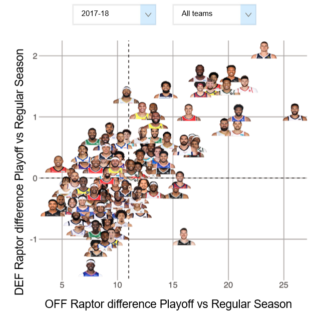
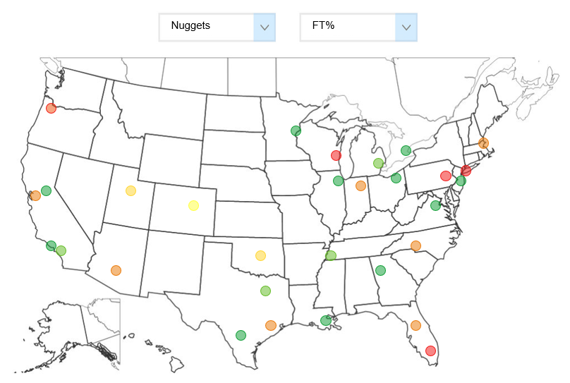
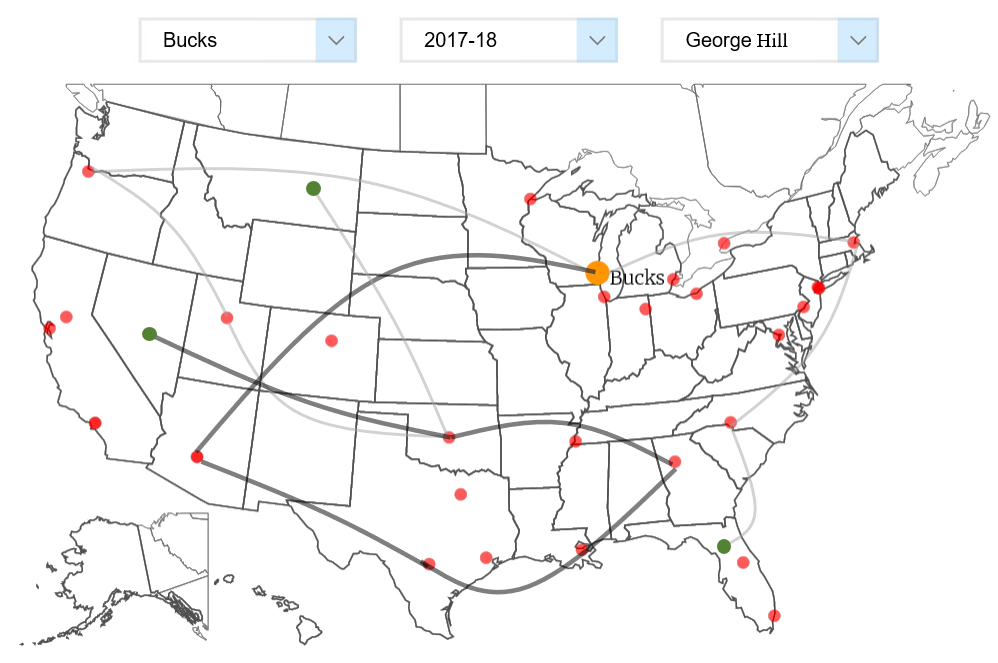

# Milestone 2

## Introduction
This project aims to create visualisations to unveil new insights into the NBA. The three main themes we explore are: player performance, team performance and player movement. Below we describe the core visualisations for each of these themes.

## Sketches of the Proposed Visualisations

### Player Performance: 

One of the most popular points of discussion among NBA fans is which players step up their performance in the playoffs vs the regular season. For example, certain players have a reputation for shrinking on the big stage, whereas others seem to thrive in high stakes games. As such, our main visualisation in this section aims to uncover these differences in player performance in the regular season vs playoffs. 

To do this, we use the all-encompassing RAPTOR advanced statistic from FiveThirthyEight to measure offensive and defensive performance across the regular and post-season. As seen in the demonstrative sketch below, we will create a scatter plot with 4 quadrants, showing the differences in performance (playoff minus regular season) for each player in a given season. Additionally, we will show players either from all teams or a user-specified team.

_MVP:_ scatter plot with dots, hover points to see player names and metric values, filtering by season and team.

_Extensions:_ allowing the user to visualise additional metrics on a similar plot, use player headshots as points on the plot, zoomable plots.

### Team Performance: 

In a typical NBA season, each of the 30 teams play 82 regular season games (+ additional playoff games if they qualify), with roughly half of these being at home and half on the road. With this visualisation, we aim to capture both head-to-head and home vs away performance for each team. 

We will make a visualisation as shown below, where a user can select a given team and a metric they’re interested in, to:
- See aggregated stats for all home vs away games
- Visualise performance according to the given metric for different head-to-head matchups, both home and away. The user can click/hover on a certain point on the map to see the selected team’s performance at that location.

_MVP:_ map with hoverable points for each team, given a home team selected from the dropdown each point is coloured on a gradient according to metric value.

_Extension:_ allow the user to select a timeframe for the visualisation, adjust point colouring by league averages for the metrics.

### Player Movement:

As a final interesting visualisation, we aim to display a player’s team history in a novel way, showing the path of a certain player through different teams they played for leading up to a given team/season.

_MVP:_ given a team, season and player, show a graph of the teams that player has played for on a map

_Extensions:_ given a team and season, show the trajectories for all players of that team on the same map (greyed out), and allow user to hover/select a specific player to highlight their trajectory. Make the graph directed. Include the players’ pre-NBA team, (either college or professional)

### Tools

There are numerous key components to our visualisations, for which we will be using the following tools:

- D3.js (including various modules of this library) - Lectures: D3.js, Interactions
  - Interactive features/animations (e.g. hovering behaviour, geopaths, dynamically changing size/colour of points, zooming etc.)
  - Loading multiple datasets
- Node-Link Diagrams - Lectures: Data, Graphs
  - Visualising player paths
- Chroma.js - Lecture: Perception Colors
  - Color scales
- GeoJSON - Lectures: Practical Maps, Maps
  - Map with NBA cities
- Javascript, HTML and CSS - Lectures: Javascript, Basic Web Development
  - Website implementation
  - Based on the following template: https://html5up.net/massively

